# LinuxMonitoring v2.0

## Part 6. GoAccess

- Установим goaccess, через sudo apt. Запустим с флагом '-f' и укажем наши файлы логов.

- В выпадающем списке выберем первый пункт меню.
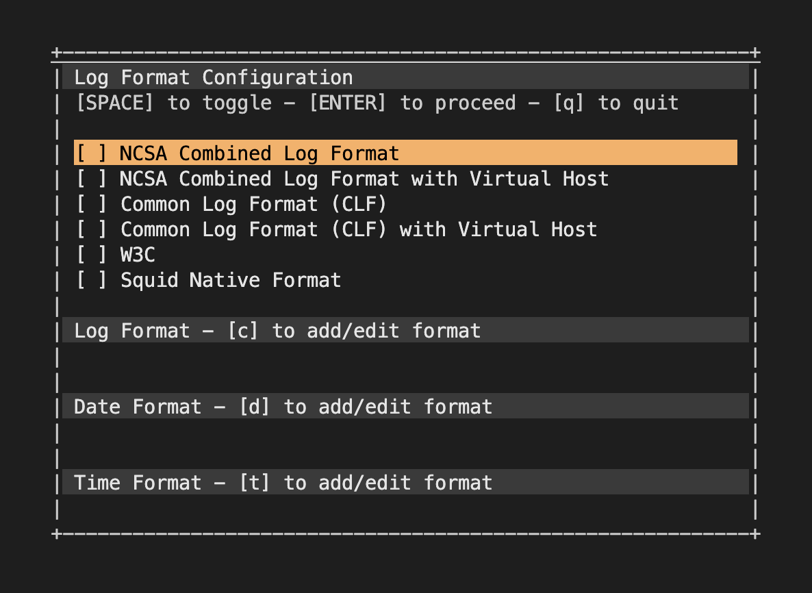

- Открываются метрики, которые мы можем анализировать
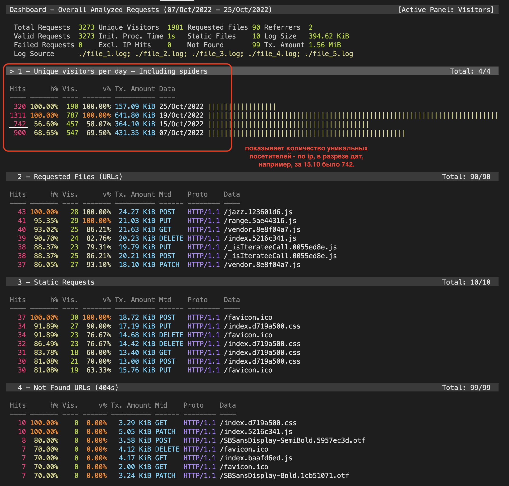
> показывает количество уникальных ip
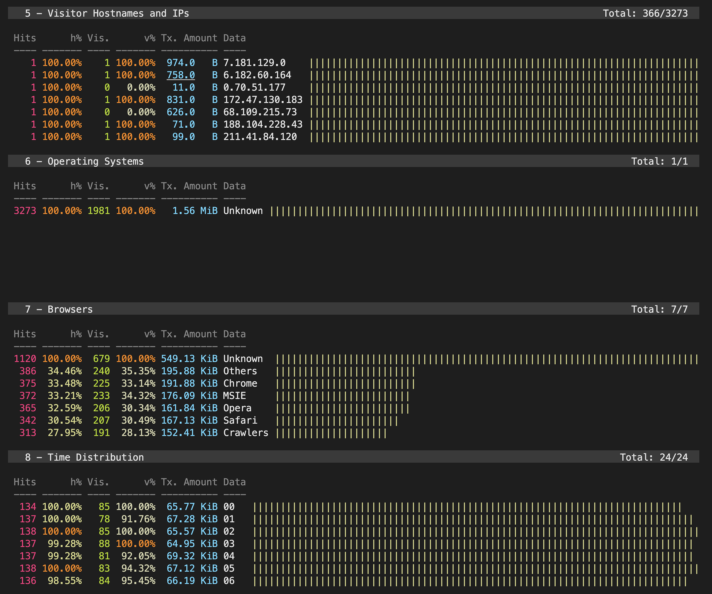
> следующий экран с метриками
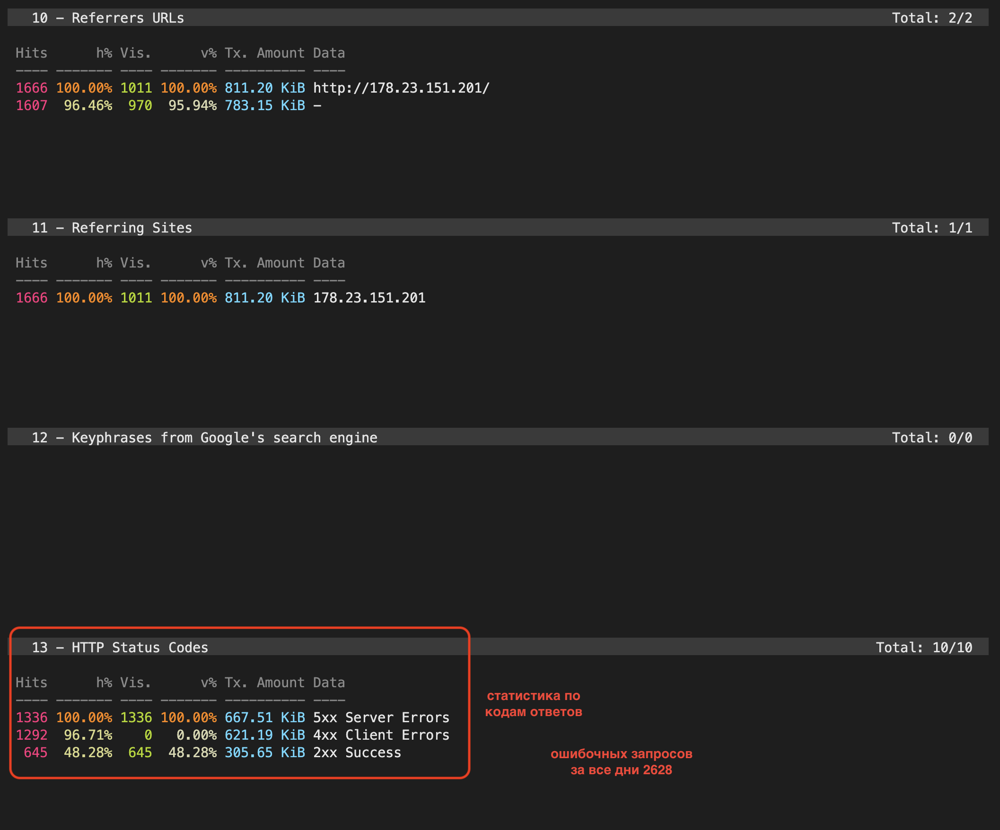
> здесь статистика по кодам ответов

- Здесь заметим, что ругается на то, что в конфиг файле не может найти формат времени.
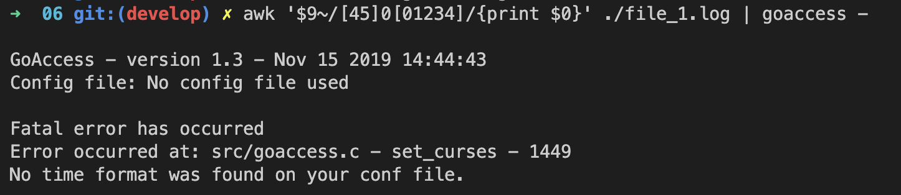
> так можно использовать конвейер через awk и вывести в goaccess только ошибочные запросы

- Настроим конфиг файл -> раскомментим необходимые строки:

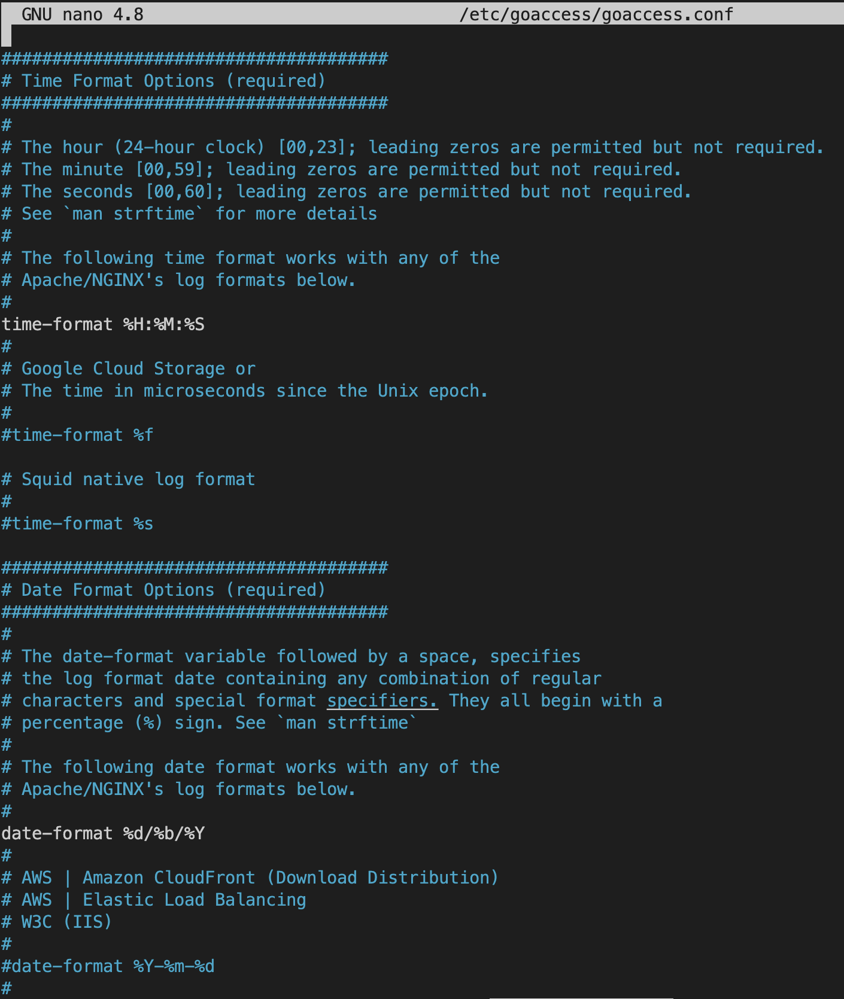
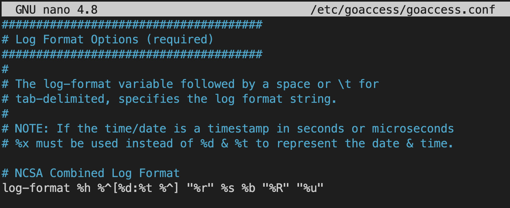

- Еще раз попробуем запустить goaccess, добавив флаг -p с указанием конфиг файла. Минус в самом конце означает ввод данных со стандартного дескриптора ввода STDINPUT.
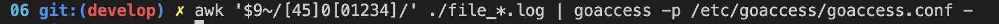

- Теперь видим только ошибочные запросы....
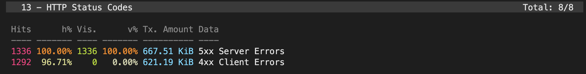

- И количество уникальных ip с ошибочными запросами.
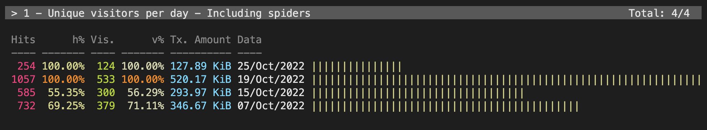

- Установим nginx и добавим в конфигфайле описание сервера (порт, откуда брать html и служебную информацию). Можно будет открывать отчет с локального компьютера через проброс портов.
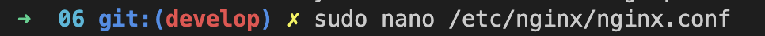
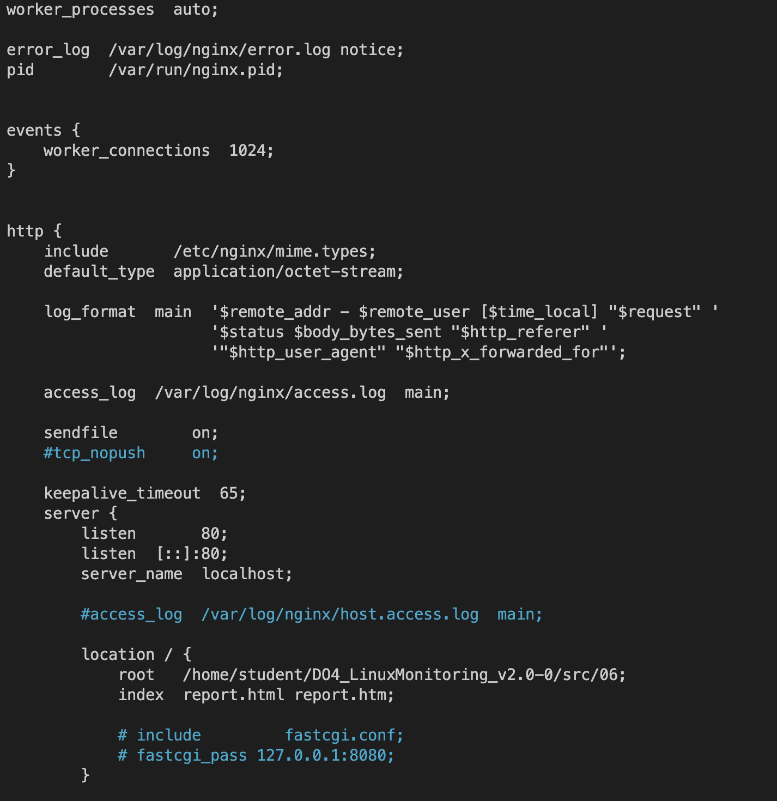

- Теперь запустим goaccess с флагом -o и укажем название веб-страницы с отчетом.
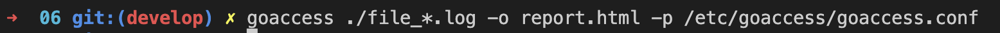

- Теперь можно открыть страницу и увидеть красивые графики.
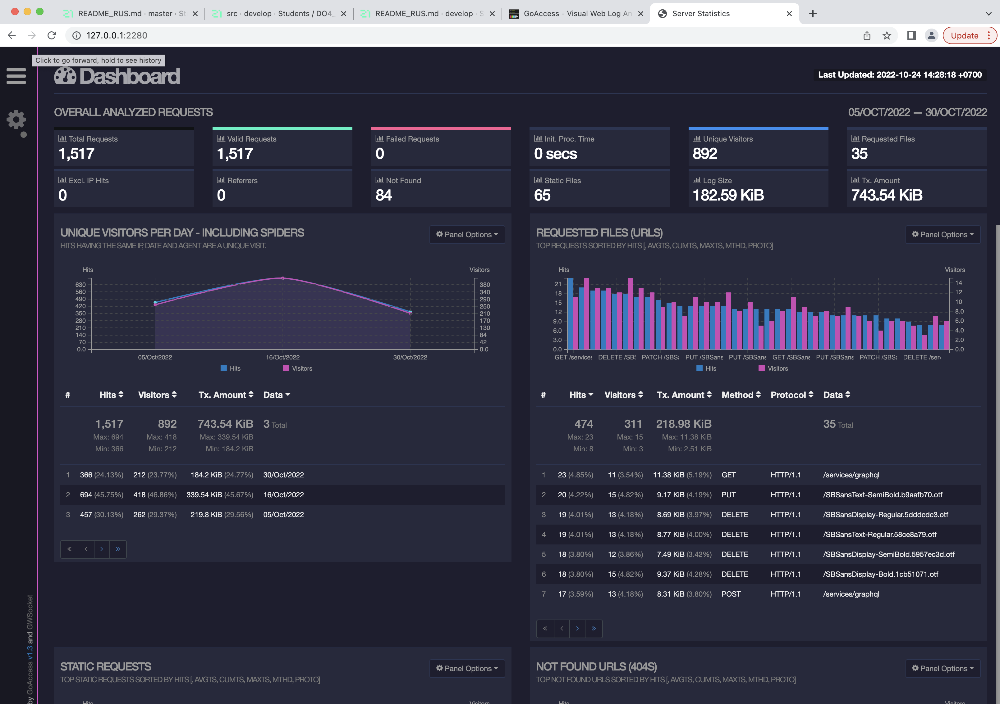

- Хороший гайд
https://kali.tools/?p=4357