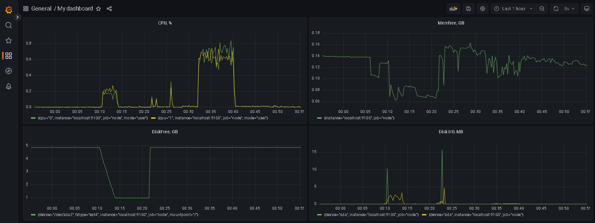

# LinuxMonitoring v2.0

## Part 7. Prometheus и Grafana

- ### **Установка Node-exporter:**
    - здесь берем ссылку на актуальную версию https://prometheus.io/download/#node_exporter
    - через wget скачиваем архив
    - распакуем архив через tar -xf
    - копируем sudo cp  node_exporter-$VERSION.linux-amd64/node_exporter /usr/local/bin
    - удаляем ненужное rm -rf node_exporter-$VERSION.linux-amd64*
    - создадим пользователя prometheus и группу prometheus, от имени которых будем запускать prometheus: sudo groupadd --system prometheus потом sudo useradd --system -g prometheus -s /bin/false prometheus
    - измените владельца созданных файлов sudo chown -R prometheus:prometheus /usr/local/bin/node_exporter
    - создайте сценарий запуска systemd сервиса node_exporter. Для этого создайте файл /etc/systemd/system/node_exporter.service со следующим содержимым:

    >[Unit] \
    Description=Prometheus Node Exporter \
    After=network.target\
    \
    [Service]\
    Type=simple\
    Restart=always\
    User=prometheus\
    Group=prometheus\
    ExecStart=/usr/local/bin/node_exporter\
    \
    [Install]\
    WantedBy=multi-user.target

    - sudo systemctl daemon-reload && sudo systemctl start node_exporter.service && sudo systemctl enable node_exporter.service
    - проверим статус службы systemctl status node_exporter.service
    

- ### **Установка Prometheus:**
    - здесь берем ссылку на актуальную версию https://prometheus.io/download/#node_exporter
    - через wget скачиваем архив
    - распакуем архив через tar -xf
    - создаем необходимые папки sudo mkdir /etc/prometheus /var/lib/prometheus
    - копируем sudo cp prometheus-$VERSION.linux-amd64/prometheus /usr/local/bin
    - еще cp prometheus-$VERSION.linux-amd64/promtool /usr/local/bin
    - и еще cp -r prometheus-$VERSION.linux-amd64/console* /etc/prometheus
    - удаляем ненужное rm -rf prometheus-$VERSION.linux-amd64*
    - sudo chown -R prometheus:prometheus /var/lib/prometheus /etc/prometheus
    - sudo chown prometheus:prometheus /usr/local/bin/prometheus /usr/local/bin/promtool
    - Создайте сценарий запуска systemd сервиса Prometheus. Для этого создайте файл /etc/systemd/system/prometheus.service со следующим содержимым:

    >[Unit]\
    Description=Prometheus\
    Wants=network-online.target\
    After=network-online.target\
    \
    [Service]\
    User=prometheus\
    Group=prometheus\
    ExecStart=/usr/local/bin/prometheus \ \
        --config.file /etc/prometheus/prometheus.yml \ \
        --storage.tsdb.path /var/lib/prometheus \ \
        --web.console.templates=/etc/prometheus/consoles \ \
        --web.console.libraries=/etc/prometheus/console_libraries\
    ExecReload=/bin/kill -HUP $MAINPID\
    \
    [Install]\
    WantedBy=default.target

    - Создайте конфигурационный файл /etc/prometheus/prometheus.yml со следующим содержимым:

    >global:\
      scrape_interval:     10s\
      \
    scrape_configs:\
      - job_name: 'prometheus'\
        scrape_interval: 10s\
        static_configs:\
          - targets: ['localhost:9090']\
      - job_name: 'node'\
        scrape_interval: 10s\
        static_configs:\
          - targets: ['localhost:9100']

    - sudo systemctl daemon-reload && sudo systemctl enable prometheus.service && sudo systemctl start prometheus.service
    - проверим статус службы systemctl status prometheus.service

- ### **Установка Grafana:**
    - sudo apt-get install -y apt-transport-https
    - sudo apt-get install -y software-properties-common wget
    - sudo wget -q -O /usr/share/keyrings/grafana.key https://packages.grafana.com/gpg.key
    - echo "deb [signed-by=/usr/share/keyrings/grafana.key] https://packages.grafana.com/enterprise/deb stable main" | sudo tee -a /etc/apt/sources.list.d/grafana.list
    - sudo apt-get update
    - sudo apt-get install grafana-enterprise
    - sudo systemctl daemon-reload && sudo systemctl enable grafana-server && sudo systemctl start grafana-server.service
    - проверим статус службы systemctl status grafana-server.service

- Хорошие гайды

    https://mcs.mail.ru/docs/additionals/cases/cases-monitoring/case-node-exporter - здесь надо брать настройки конфиг файлов

    https://medium.com/devops-dudes/install-prometheus-on-ubuntu-18-04-a51602c6256b - здесь порядок действий, кроме конфиг файлов и версий (актульные на сайте прометеуса)

    https://grafana.com/docs/grafana/latest/setup-grafana/installation/debian/ - здесь про установку графаны

- Теперь запусти скрипты из 2 и 3 части, а потом скрипт `stress -c 2 -i 1 -m 1 --vm-bytes 32M -t 10s`. Также я запускал на несколько минут. Вот, что получилось.

