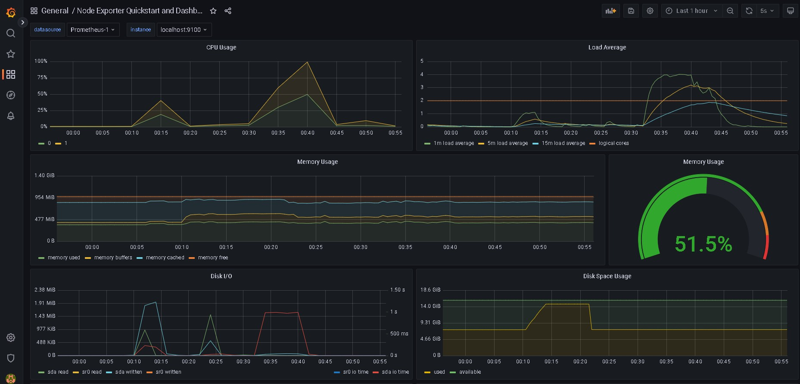
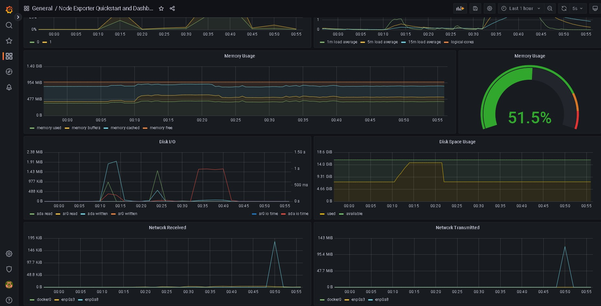
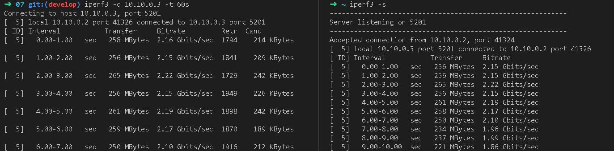

# LinuxMonitoring v2.0

## Part 8. Готовый дашборд

- На сайте графаны ищем нужный дашборд https://grafana.com/grafana/dashboards/ и копируем его номер. Затем импортируем его в графане.

- Открывается такой дашборд. Проводим тесты из прошлого задания.

- Теперь запустим `iperf3` и посмотрим как реагирует сеть на дашборде.

