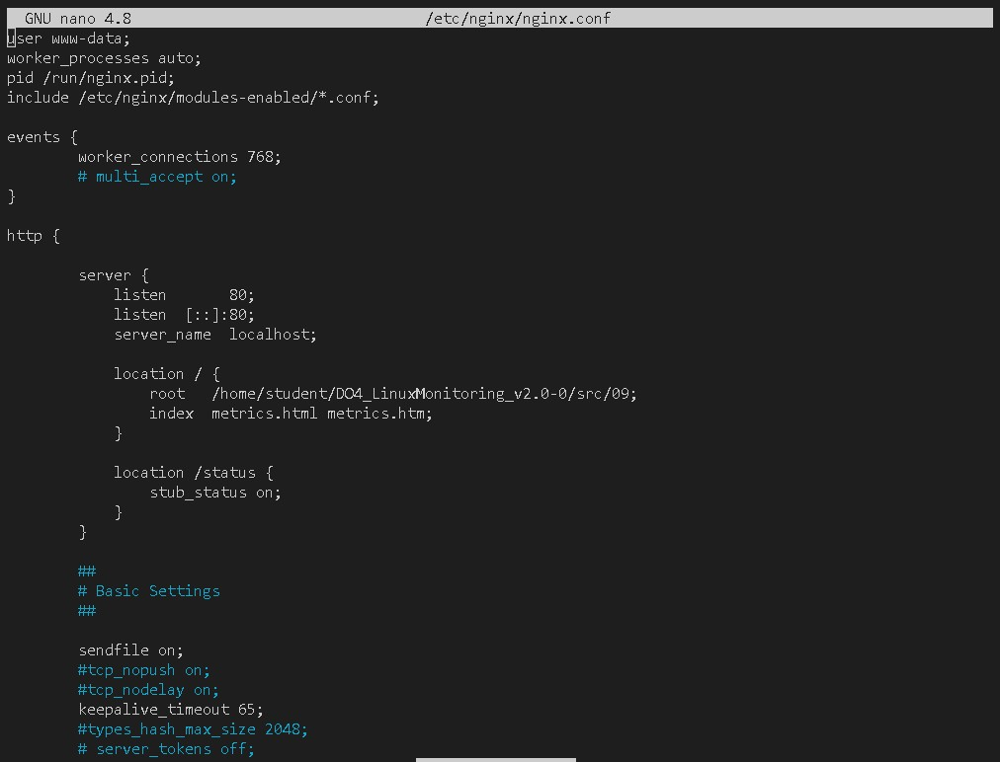
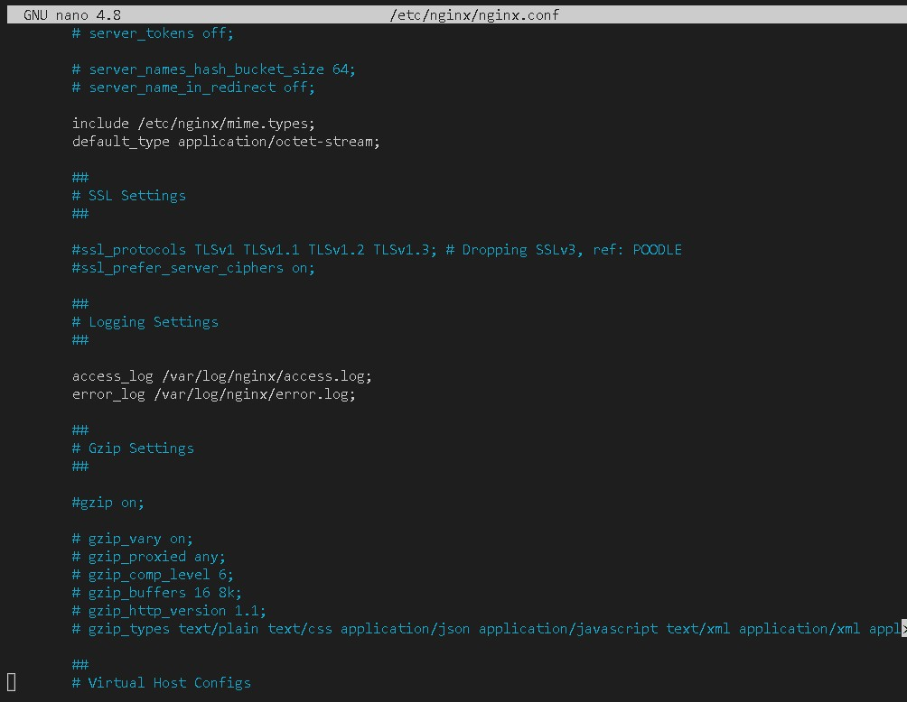
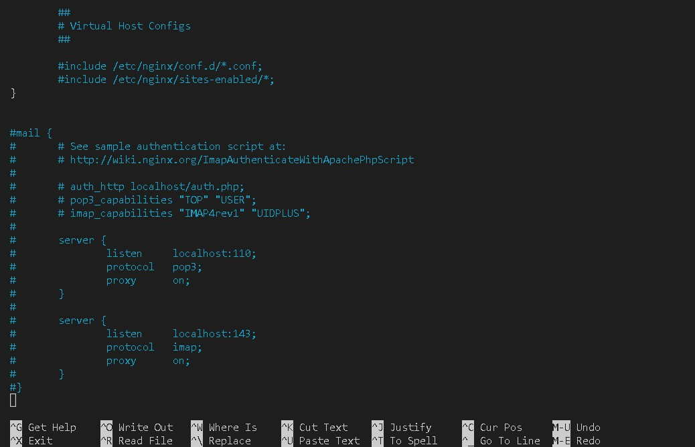
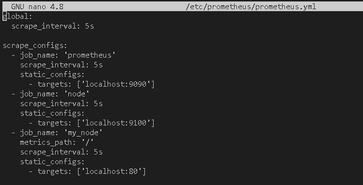
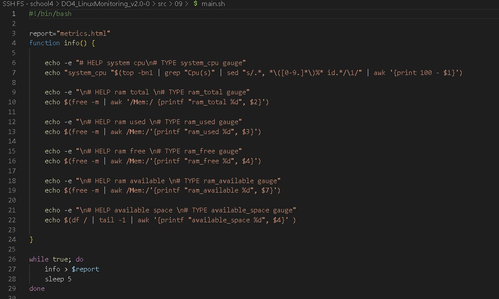
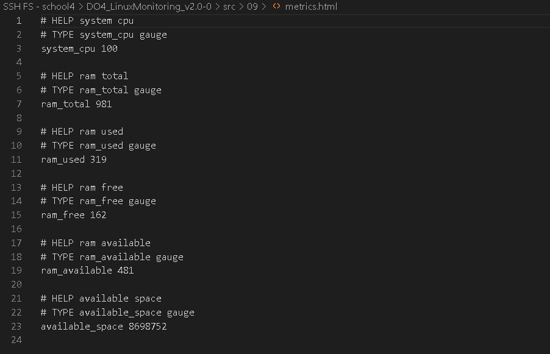
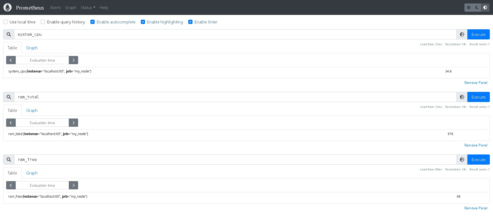
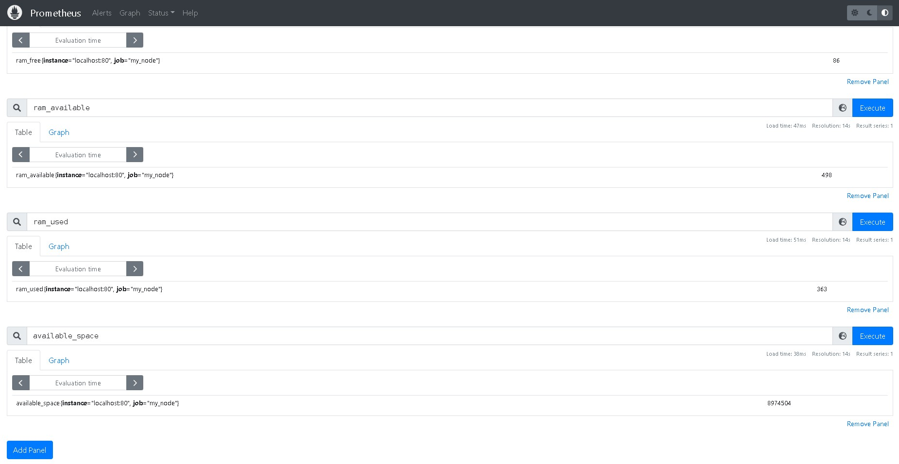
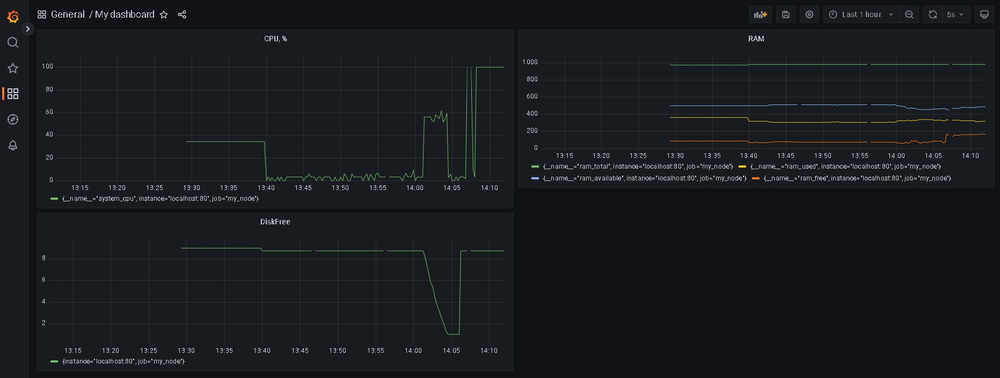

# LinuxMonitoring v2.0

## Part 9. Дополнительно. Свой node_exporter

- Сначала установим nginx и в файле `/etc/nginx/nginx.conf` добавим описание сервера (порт, локацию html файла и служебную инвормацию).

---

- Затем `sudo systemctl restart nginx.service`

- В конфиг файл прометеуса добавим новый джоб:

- Теперь напишем скрипт, который будет формировать html страницу по формату `node-exporter`, которую будет забирать прометеус от энджинкса. На этой странице нужно предусмотреть уникальные имена метрик, по которым мы будем их искать в прометеусе.

- Такой формат html файла должен получиться.

- На странице прометеуса можно выбрать наши метрики.

- В графане создаем дашборд, где выводим панели с нашими метриками.

- Так можно создать любой кастомный экспортер.
